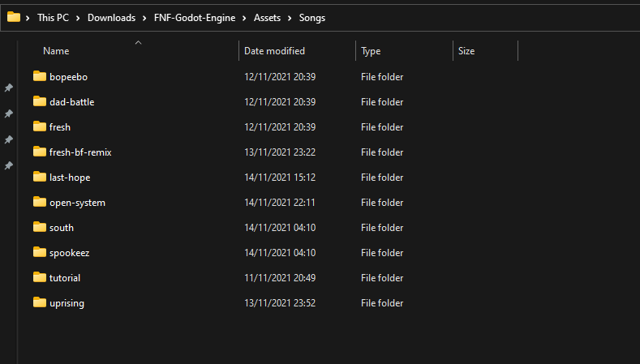
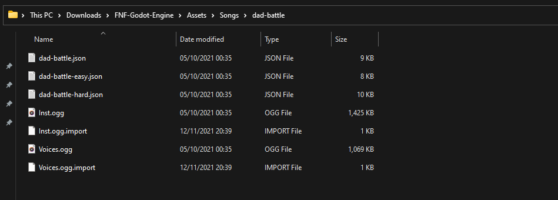
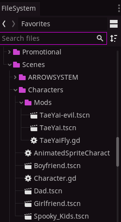
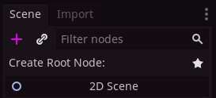
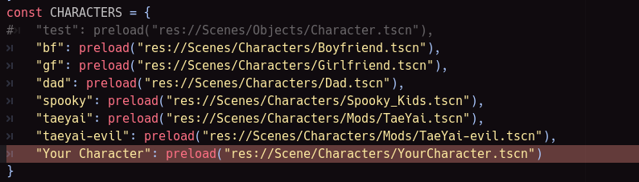

# FNF Godot Edition DOCS

## Introduction
Hello and welcome to the DOCS for the FNF Godot Edition Engine. Which (As you might know) Runs on the Godot Engine!

There are a few things to go through first so heres a list.
* You need to know the basics of Godot (We Suggest GDQuest's Tutorial [Series](https://www.youtube.com/watch?v=42HKCFf5Lf4&list=PLhqJJNjsQ7KEcm-iYJ2a8UCRN62bTneKa&index=1&t=0s)).

* You need basic programming knowledge (You should Know that by now)

Okay Enough Intro let's dig in into the Good Stuff.

## Adding a Song
Okay this is Pretty easy to do.

The Engine reads everything in Assets/Songs so as long as you follow the folder structure it should show up in FreePlay.

Here's what a normal Songs Folder looks like: 

In a Song Folder there should be Inst.ogg, Vocals.ogg, song-name-easy.json, song-name.json, song-name-hard.json.

Pretty Simple Right?

Here's what a Song Folder should look like: 

Ignore the .Import Files Godot automatically adds those.

Once you add your Song it should show up in FreePlay and play normally.

There is no Charter in-game for now but you can use any Friday Night Funkin' Charter!

## Adding a Character

Okay enough baby stuff let's get into the actual hard stuff.

So if you didn't watch GDQuest's Video's and refused to take the time to learn about Godot I'll Explain what a Scene is.

Everything is a node in Godot. a Scene is just a node that is placed at the top of the hierarchy, under the root node. The scene consists of multiple other nodes.

If you didn't understand that go watch GDQuest's Playlist I can stress this enough!

Character Scenes are located in Scenes/Characters, They look like this.

The Scenes end in the .tscn format the .gd Files are scripts.

to Create a Character Right-Click on Either Characters or Characters/Mods and Click "Create New Scene"

a New Scene Should be Created.

For 'Create Root Node' Select 2D Scene like this shown here:

Once you've created a scene double-click the 'Node2D' Node and rename it to your Character Name.

Now if you have a SpriteSheet that does not use an xml.
Create a Sprite then add a Animation Player Node. Now Attach the Character.gd Script to the Root Node.

Add your SpriteSheet to Assets/Stages/Character/'Your Character Name'/'YourCharacterSheet'.png

Click on the AnimationPlayer Node and on the Inspector Tab next to it there should be a 'Node' Tab. Click it, Now right-click on the 'animation_finished' Connection and Connect it to the Root-Node

Now you add these animations to the AnimationPlayer

* idle
* singDOWN
* singUP
* singLEFT
* singRIGHT

Now you can work on those animations on the frame property of the Sprite. (I can't help you here otherwise the Section would be 10 Pages long lmao)

Now if you have a Image File and a XML File you would do the same up to creating a Root Node Expect now you just create a AnimatedSprite Node. Attach the 'animation_finished()' Connection to the root node which should have AnimatedSpriteCharacter.gd attached to it.

Now add your Spritesheet and XML File to 

Assets/Stages/Character/'Your Character Name'/'YourCharacterSheet'.png

Assets/Stages/Character/'Your Character Name'/'YourCharacterSheet'.xml
Once you added those you need to use the XML_To_SpriteFrames Scene to convert your XML and png Files to a .res file to do so just:

Open the Scene in Scenes/Tools/XML_To_SpriteFrames.tscn and run click this button in the top right as shown here. 

This will ONLY run that Scene. now follow the gui intructions and come back to me once you've done it.

Okay did you do it? Great the GUI should have told you where the .res file is located so all you need to do is Go back to your Character Scene, Click the AnimatedSprite Scene and set the 'SpriteFrames' to that .res file.

Once you done that open the SpriteFrames and rename the animations to:
* idle
* singDOWN
* singUP
* singLEFT
* singRIGHT

Now we need to tell the SceneLoader autoload that we have a new character.

So we need to open AutoLoads/SceneLoader.gd
Open that then we need to add the character to the directory variable as shown here.

Make sure the name of your character in the string should be the player 2 variable in the jsons.

## Add a Stage

Adding a Stage is easy too, to do that you need to right click on the PlayState File (Located in Scenes/States)

and click on 'New Inhertited Scene'
It should open a new scene of the playstate.

Save it to Scenes/Stages

To add a background create a new node on the root node and select the type 'Paralax Background'

Now Create a new Node with the type 'Paralax Layer'

Now Create another node with the type of 'Sprite'

set the texture property in the sprite node to your BG.

To add background props or what not. Just add a new Paralax Layer with a Sprite as it's child and set that texture to whatever.

Now we need to add the stage into the SceneLoader.gd AutoLoad which is the same thing to the character as we did before

Create it in the Stages Directory Variable instead, make sure the string name matchs the stage in the jsons, and put your stage location into the "preload()" function

## Events

For the moment events are hard-coded into playstate.gd
open that script and search for the "hardcoded_events()" function, as you can see there is a few examples there for you

Just follow the example.

now to get the songPosition you need to play the song and look at the debug output, You will see the songPos float being printed for you.

when you find the correct songPos by waiting for the "event" that would happen and looking at the debug Output just simple put it in like the example shows.

## ModChart Support?

We will write DOCS on those soon, we are not there yet tho.

# Summary

Wow you survived the DOCS Good for you!

Hopefully you understand how to mod with the Engine now.

If theres anything at all you'd like me to add or show you how to do something DM me at linuxmaster 2.0#6062
